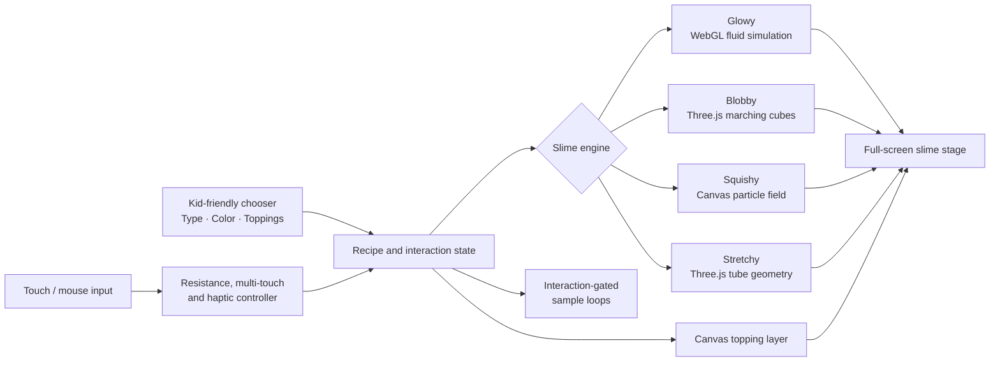

# Rye-Rye’s Slime Time

Rye-Rye’s Slime Time is a playful, touch-first slime table for kids. Choose a slime style and color, add toppings, then poke, swirl, stretch, and squish it with responsive physics, sound, and mobile haptics.

**[Play Rye-Rye’s Slime Time](https://new-project-please-just-a-simple.vercel.app)**


## Technical architecture




Built with Vite, Three.js, WebGL Fluid Enhanced, Canvas 2D, and the Web Audio and Vibration APIs.

## Run locally

```bash
npm install
npm run dev
```

[MIT licensed](LICENSE).
