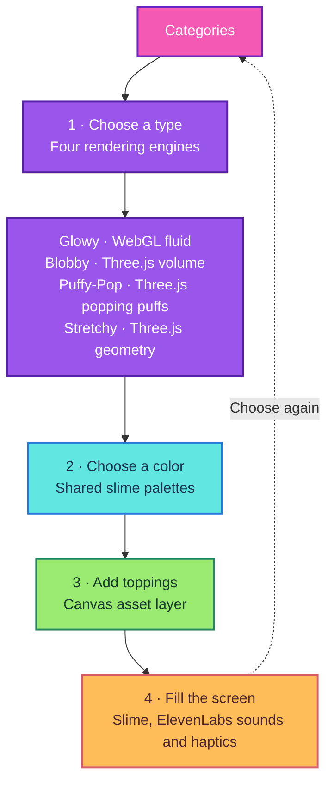
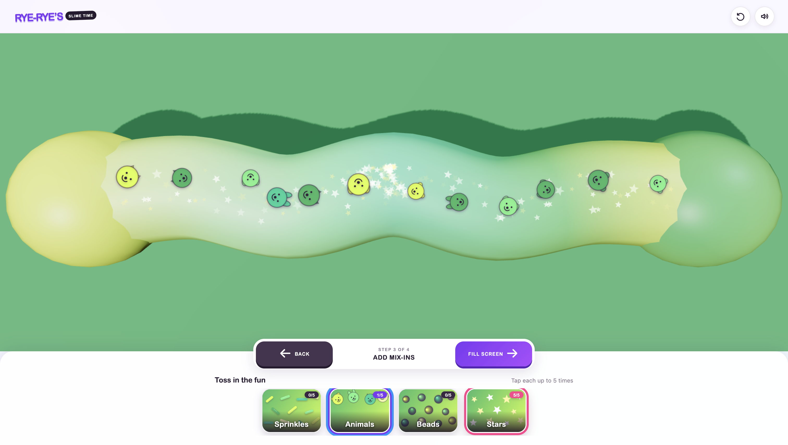
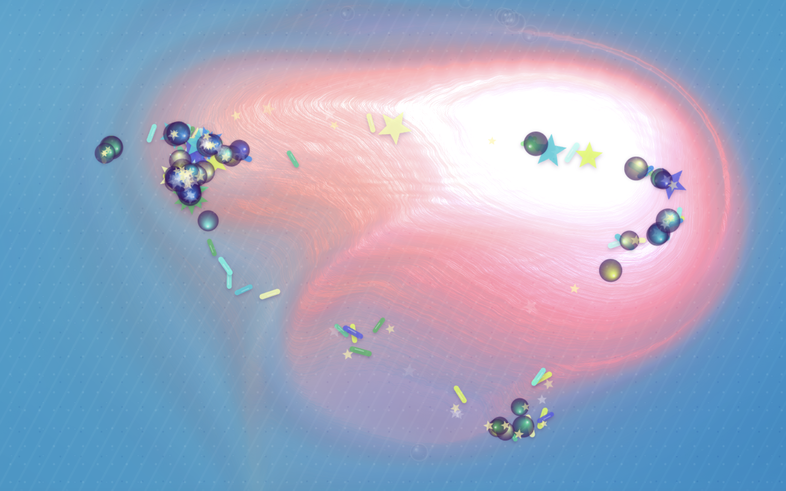
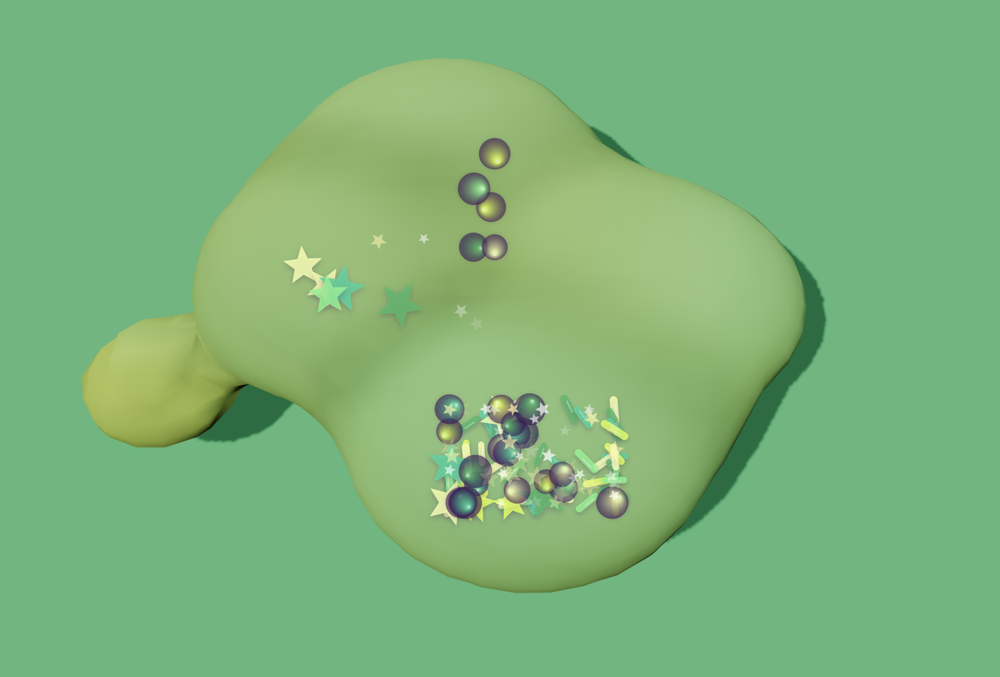
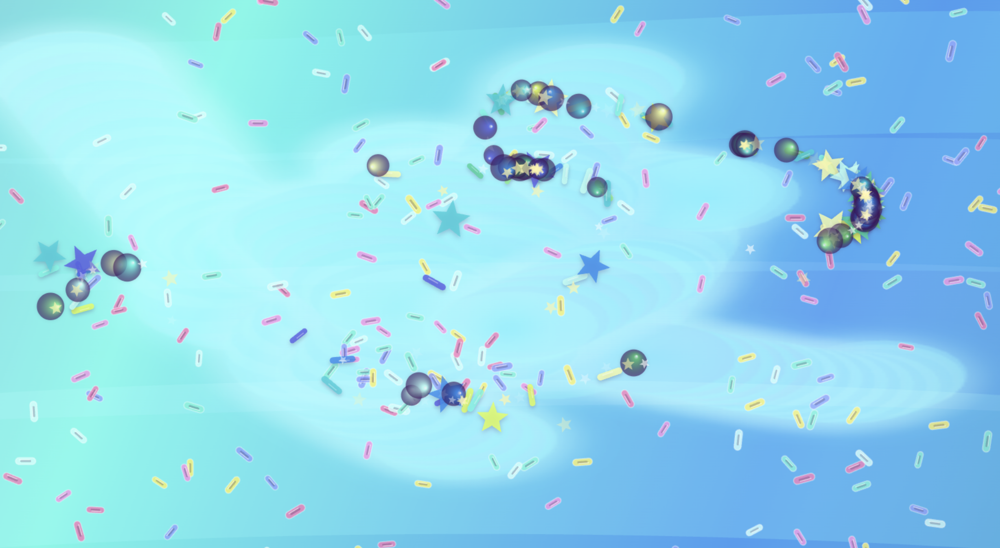
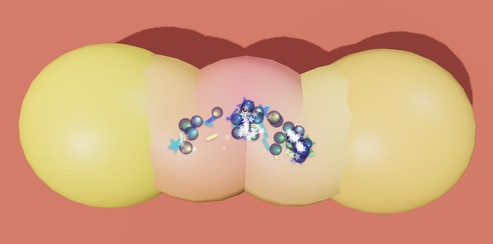

# Rye-Rye’s Slime Time

Rye-Rye’s Slime Time is a playful, touch-first slime table for kids. Choose a slime style and color, add toppings, then poke, swirl, stretch, and squish it with responsive physics, sound, and mobile haptics.

**[Play Rye-Rye’s Slime Time](https://new-project-please-just-a-simple.vercel.app)**

## Technical architecture

## The joy of slime

Slime turns texture, repetition, and transformation into open-ended play. For some autistic people, self-chosen tactile input and sensory or fidget toys can be comforting or support self-regulation, although sensory preferences are individual and slime will not suit everyone ([National Autistic Society](https://www.autism.org.uk/advice-and-guidance/about-autism/sensory-processing)). A screen cannot reproduce all the pressure, shear, weight, and stiffness of a physical toy, so software experiments like this one use responsive motion, resistance, sound, and vibration to suggest a small part of that tactile and kinaesthetic experience ([review of haptic virtual-object research](https://pmc.ncbi.nlm.nih.gov/articles/PMC9919508/)).

<table>
  <tr>
    <td width="50%"></td>
    <td width="50%"></td>
  </tr>
  <tr>
    <td width="50%"></td>
    <td width="50%"></td>
  </tr>
</table>

Built with Vite, Three.js, WebGL Fluid Enhanced, Canvas 2D, the Web Audio and Vibration APIs, and sounds from ElevenLabs.

[MIT licensed](LICENSE).
