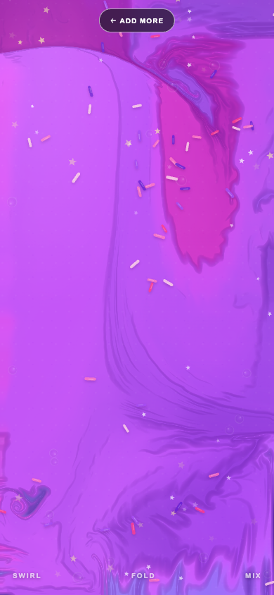

# Rye-Rye’s Slime Time



A touch-first, bird’s-eye slime table for curious fingers. Pick a slime, toss in candy, then slowly fold, swirl, and mix the whole screen.

## Play it

**[Play Rye-Rye’s Slime Time](https://new-project-please-just-a-simple.vercel.app)**

## What makes it feel like slime

- Three kid-friendly steps: **Slime → Mix-ins → Squish**
- A full-stage GPU fluid simulation with pressure projection, dye advection, curl, and slow viscosity-like damping
- The slime fills the table instead of behaving like one round blob; every gesture folds and mixes the color field beneath it
- A high-resistance touch follower trails the finger, caps each push, and keeps pulling briefly after release so the surface feels thick instead of watery
- Real multi-touch stirring, with a separate fluid ribbon and topping wake for each finger
- Procedural cloud-slime audio that repeats for as long as a finger or mouse is held down, layering low gooshes with tiny crunchy grains
- Short vibration patterns through the browser Vibration API where supported, with visual/audio feedback everywhere else
- An original AI-generated clay-candy sprinkle texture, plus stars, beads, and animated glitter
- Responsive full-screen slime mode, keyboard controls, reduced-motion support, and a locally saved recipe
- No tracking

## Run it

```bash
npm install
npm run dev
```

Build the static site with:

```bash
npm run build
```

## Controls

- Touch/mouse: hold and draw slow circles to fold the slime
- Multi-touch: stir two parts of the table at once
- Hold still: hear the repeating crunchy, gooshy cloud-slime texture
- Keyboard: arrow keys push the current; Space or Enter adds a swirl

## Open-source research

The full-screen approach was researched against several open-source fluid projects:

- [WebGL Fluid Enhanced](https://github.com/michaelbrusegard/WebGL-Fluid-Enhanced), the MIT-licensed GPU solver used by the app
- [PavelDoGreat/WebGL-Fluid-Simulation](https://github.com/PavelDoGreat/WebGL-Fluid-Simulation), the original browser fluid simulation that inspired the maintained wrapper
- [gpu-io](https://github.com/amandaghassaei/gpu-io), researched as a lower-level option for a future custom viscoelastic shader
- [LiquidFun](https://github.com/google/liquidfun), evaluated but not selected because free-surface particles naturally return to puddles and blobs rather than filling the table

Rye-Rye’s Slime Time pins WebGL Fluid Enhanced `0.8.0` and adds its own full-screen seeding, slow touch tuning, topping advection, cloud-slime Web Audio instruments, vibration cues, and accessible game flow in `src/main.js`.

## Generated art

`public/candy-sprinkles.jpg` is original project art made with OpenAI's built-in image generation tool. It was prompted as a seamless-feeling square tile of chunky rainbow sprinkles, jelly stars, wobbly dots, gummy moons, and confetti curls in a soft-clay/cut-paper style, with no text, faces, logos, or watermark.

## License

[MIT](LICENSE)
